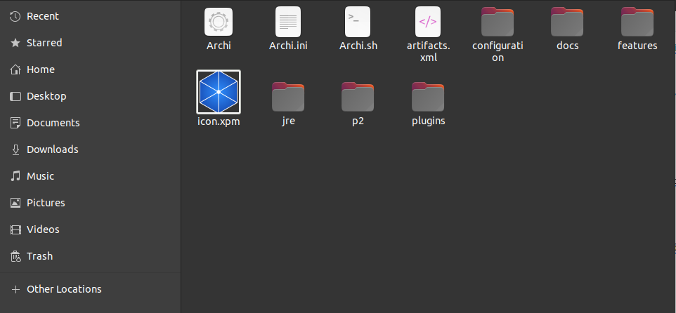

# quantitative_analysis | Installation guide
----

Author: [Franco Gil](https://github.com/realFranco)

## Installation guide

### Directory

- [Archi Application](#archi-application)
   - [Install Archi Application](#install-archi-application)
   - [Run Archi Application](#run-archi-application)
- [Plug-in jArchi](#plug-in-jarchi)
   - [Download jArchi plug-in](#download-jarchi-plug-in)
   - [Install plug-in jArchi](#install-plug-in-jarchi)
   - [Install jArchi plug-in (alternative method)](#install-plug-in-jarchi-alternate-method)
   - [Configure jArchi plug-in](#configure-plug-in-jarchi)
- [Web Service](#web-service)
   - [Install elements for the Web Service](#install-elements-for-the-web-service)
   - [Create a virtual environment and install dependencies](#create-a-virtual-environment-and-install-dependencies)
     - [Add necessary elements for the execution of the tool](#add-necessary-elements-for-the-execution-of-the-tool)
     - [Run Web Service](#run-web-service)
     - [Use of the Web Service](#use-of-the-web-service)
       - [File Upload](#file-upload)
       - [Run Archi Tool](#run-archi-tool)
       - [Show and Export Simulation Results](#show-and-export-simulation-results)


To install the quantitative analysis tool, three (3) main components will be necessary:

  - Archi application (stable version 4.10.0).
  - jArchi plug-in for the Archi application (stable version 1.20.0).
  - Web service defined in this project (`quantitative_analysis`) in its most recent stable version.

It will explain how to install and configure each component, as graphic elements images will be added
to assist in configuration flows.

> Notes:
> 1. The Archi application and the Web Service have been tested on a Linux Operating System under the Ubuntu 20.04 distribution.
> 2. Some of the installation steps will require interaction with a terminal (Shell).

## Archi App
----

### Install Archi App
----

As an initial step, you must download the Archi 4.10.0 application, for now it will be available at:

> https://www.archimatetool.com/download/


In case Archi 4.10.0 is not the most recent stable version, it can also be found here:

> https://www.archimatetool.com/archive/


Once the tool has been downloaded, the resources will be extracted.

```shell
tar -xvf Archi-Linux64-4.10.0.tgz
```

### Run Archi Application
----

Once the jArchi plug-in is installed within the Archi tool, the application will be executed.

Run the file "Archi".



The first time the Archi application is launched, it will appear with the following welcome interface:


At this point, the jArchi plug-in should be installed, continue with the next sections.

## jArchi Plugin
----

### Download jArchi plugin
----

This plug-in (jArchi) has its source code available at:

> https://github.com/archimatetool/archi-scripting-plugin

The generation of the packages object for Java is outside the scope of this installation guide. That is why they will be used
packages already available for integration with the Archi application.

> https://drive.google.com/file/d/1v04bh5Kk-dz6Qgv5KBOV3sYaAlPAt8nQ


### Install jArchi plugin
----

To install the jArchi plug-in, the Archi application must already be installed and running.

Select the `Help -> Manage Plug-ins` option


Next, the `Install New` option is selected

In the window to explore directories, look for the compressed file with extension `.zip` or `.archimate` downloaded in the section [Download jArchi plug-in](#download-plug-in-jarchi).


Select the file and click `Open`.

Once the plug-in is installed, the Archi application will indicate that a restart of the application is necessary to complete the installation,
click on `Yes`.

If when you select the `Help -> Manage Plug-ins` option again you do not see the installed plug-in, follow the flow in the next section.

### Install jArchi plug-in (alternative method)
----

Open a shell in the directory where the jArchi plug-in has been downloaded and copy the items to the `Archi/plugins/` directory
of the Archi application.

```shell
unzip jArchi_1.2.0.202110121451.archiplugin.zip -d Archi/plugins/
```

Once the Archi application is instantiated again, select the option to create a new diagram or continue using the application.

Repeat the `Help -> Manage Plug-ins` flow and see if the plugin is installed.


### Configure jArchi plugin
----

In order to execute the scripts written for the plugin as expected, the plugin must be configured:

   - Change the interpreter to Nashhorn 6:
     - Go to `Edit -> Preferences`
     - Select the `Scripting` option
     - In the `JavaScript Engine` entry select `Nashhorn ES6 (deprecated)`
     - Click on `Apply and Close`
         
   - Indicate the path of scripts from where they will be executed.
     - Go to `Edit -> Preferences`
     - Select the `Scripting` option
     - In the `Scripts Folder` entry, click the `Choose` button
         
     - A directory browser will open, select the `scripts/` directory of the `quantitative_analysis` project and then click `Open`
         
     - In the `Preferences` window click on `Apply and Close` to confirm changes

At this point it will be possible to download the Web Service that contains interfaces to run the application in a more
simple, display and download the results of the simulations.

## Web Service
----

The `quantitative_analysis` project contains elements to deploy the "Web Service", it can be downloaded from the following link:

> https://github.com/realFranco/quantitative_analysis

### Download Web Service
----

Since the project is hosted from the `GitHub` source code versioning tool, it has several ways to download
Projects. This time we will download the project from the terminal (Shell).


```shell
git clone git@github.com:realFranco/quantitative_analysis.git
```

### Install elements for the Web Service
----

Once the project is downloaded, open a terminal in the `quantitative_analysis/` directory.

As previous dependencies, the user's host must have at least `Python` installed in its stable version `3.8.10`

#### Create a virtual environment and install dependencies
----

```shell
cd web_service/backend

python3 -m venv venv

source venv/bin/activate

pip3 install -r requirements.in
```

#### Add necessary elements for the execution of the tool
----

To run the service correctly, some resources are necessary:

  - Archimate diagram valid for the Archi application. An Archi diagram can be exported from the option
  `File -> Save As`, this diagram and the necessary ones should be copied to the `resources/archi_diagram_example/` directory

     

  - Amazon Web Services (AWS) CloudWatch logs. It is out of the scope of this guide how to configure an architecture in
  AWS that generate log metrics on the AWS CloudWatch Insights service, an image will be added that reflects a little
  how the logs usable by the infrastructure are consulted and exported.

The following syntax is a particular AWS CloudWatch Insights language that will allow you to query and filter logs within
from service.


Query to collect compute metrics:

```
fields request_id,@message
```

Query to collect execution status:

```
fields @requestId,code
| filter code like /.+/
```

The previous queries will generate logs and these must be exported in `.json` format, store these
two files as they will be useful in later Web Service flows.


To expand the reference on the AWS CloudWatch Insights query syntax, see the following links:

> https://docs.aws.amazon.com/AmazonCloudWatch/latest/logs/CWL_QuerySyntax.html
> https://docs.aws.amazon.com/AmazonCloudWatch/latest/logs/CWL_QuerySyntax-examples.html

#### Execute Web Service
----

The following steps will allow the Web Service to be executed:

  - In the section [Create a virtual environment and install dependencies](#create-a-virtual-environment-and-install-dependencies)
  If you already had a terminal (Shell) available, use it again or use a new one.

     

  - Generate environment variables:

   ```shell
   # Go to the web_service/backend/ directory
   cd web_service/backend
   # Create the file with the environment variables and edit the variables as necessary
   cp dist.env .env
   ```

   An example of the environment variables to be defined are the following (tested on an Ubuntu-based Linux Operating System):

   ```
   # Directory. Replace the current value with the folder container for "Archi".
   ARCHI_RUNNABLE=/home/diuble-lig/Desktop/archi/Archi/Archi.sh

   # Project name. If you change the name for the current project, also change this value.
   PROJECT_NAME=quantitative_analysis

   # Directory. Absolute route from the host to the project, if you change the project directory structure, also change this value.
   PROJECT_LOCATION=/home/diuble-lig/Desktop/archi/Archi/${PROJECT_NAME}/

   # Localhost address to communicate between client and server.
   PROJECT_HTTP_PROTOCOL=http
   PROJECT_LOCALHOST=127.0.0.1
   PROJECT_PORT=8000
   PROJECT_LOCALHOST_URL=${PROJECT_HTTP_PROTOCOL}://${PROJECT_LOCALHOST}:${PROJECT_PORT}

   # Location file where put the configurations for jArchi scripts.
   SCRIPT_CONFIG_LOCATION=resources/jArchiConfigResources.json

   # Location file for the result file after run some jArchi scripts.
   COMPUTE_RESOURCE_LOCATION=resources/jArchiComputeResources.json

   # Location file where put the Quantitative Analysis results.
   QUANTITATIVE_ANALYSIS_RESULT_LOCATION=resources/jArchiQuantitativeAnalysisResults.json
   ```

  - Go to the `web_service/backend/` directory and run the `main.py` web service entry point:

   ```shell
   cd web_service/backend

   source venv/bin/activate

   python3 main.py
   ```

  - Informative messages about the instantiated service will appear inside the terminal, including a web address.
  `http://127.0.0.1:8000` (as long as the environment variables defined in `.env` are kept by default) give
  Click it to display the Web Service interface.


#### Using the Web Service
----

Next, iconographies and information on the use of the Web Service interface will be shown.

##### File Upload
----

- Click the `Search input files` button
- A modal will open, select the option `Amazon Web Services`
- In the `Log files` entry, "search" the log files
   - Locate the downloaded `.json` in the section
   [Add necessary elements for the execution of the tool](#add-necessary-elements-for-the-execution-of-the-tool)
    and select them
- Click on `Upload files`
     

##### Running the Archi tool
----

- Click the `Run Archi` button
- Stop and look at the image carousel in the `Image Sequence' section to learn how to run simulations`
with the objective of knowing the flows to follow before executing the Quantitative Analysis script
- In the input `Select Archimate diagram` choose the corresponding diagram on which to apply the Quantitative Analysis
- In the input `Select the initial object to start the simulation` choose an element of the diagram on which to start the Quantitative Analysis
- Click the `Run Archi` button of the modal
   - If the Archi application is not running, the Back end service will run it, showing the Archi launch interface on the web browser
       

##### Show and Export Simulation Results
----

- After having executed at least one (1) time the Quantitative Analysis scripts within the Archi tool, click on the `Reload` button enabling the `Show results` button
- Two sections will be displayed, a heat map next to a table and below two tables with values
     

     
- In the table with the title `Simulations History` each row can be clicked, this action will show in the table with the title `Results Table | Tabulated` the results of that particular simulation
- Clicking on the `Clear` button will delete the simulation results and hide the results sections
- To export the results of the selected simulation or the most recent one executed, click on the `Download Results` button, this will show an interface indicating to the user that he is going to download a file
     
