# quantitative_analysis | Guía de Instalación
----

Autor: [Franco Gil](https://github.com/realFranco)

## Guía de Instalación

### Directorio

- [Aplicación Archi](#aplicación-archi)
  - [Instalar Aplicación Archi](#instalar-aplicación-archi)
  - [Ejecutar Aplicación Archi](#ejecutar-aplicación-archi)
- [Plug-in jArchi](#plug-in-jarchi)
  - [Descargar plug-in jArchi](#descargar-plug-in-jarchi)
  - [Instalar plug-in jArchi](#instalar-plug-in-jarchi)
  - [Instalar plug-in jArchi (método alternativo)](#instalar-plug-in-jarchi-método-alternativo)
  - [Configurar plug-in jArchi](#configurar-plug-in-jarchi)
- [Servicio Web](#servicio-web)
  - [Instalar elementos para el Servicio Web](#instalar-elementos-para-el-servicio-web)
  - [Crear un entorno virtual e instalar dependencias](#crear-un-entorno-virtual-e-instalar-dependencias)
    - [Agregar elementos necesarios para la ejecución de la herramienta](#agregar-elementos-necesarios-para-la-ejecución-de-la-herramienta)
    - [Ejecutar Servicio Web](#ejecutar-servicio-web)
    - [Utilización del Servicio Web](#utilización-del-servicio-web)
      - [Carga de Archivos](#carga-de-archivos)
      - [Ejecución de la herramienta Archi](#ejecución-de-la-herramienta-archi)
      - [Mostrar y Exportar Resultados de las Simulaciones](#mostrar-y-exportar-resultados-de-las-simulaciones)


Para instalar la herramienta de análisis cuantitativo serán necesarios tres (3) componentes principales:

 - Aplicación Archi (versión estable 4.10.0).
 - Plug-in jArchi para la aplicación Archi (versión estable 1.20.0).
 - Servicio Web definido en este proyecto (`quantitative_analysis`) en su versión estable más reciente.

Se explicará cómo instalar y configurar cada componente, como elementos gráficos se agregarán imágenes
para ayudar en los flujos de configuración.

> Notas:
> 1. La aplicación Archi y el Servicio Web se han probado en un Sistema Operativo Linux bajo la distribución Ubuntu 20.04.
> 2. Algunos de los pasos de instalación requerirán interacción con un terminal (Shell).

## Aplicación Archi
----

### Instalar Aplicación Archi
----

Como paso inicial se debe descargar la aplicación Archi 4.10.0, de momento estará disponible en:

> https://www.archimatetool.com/download/


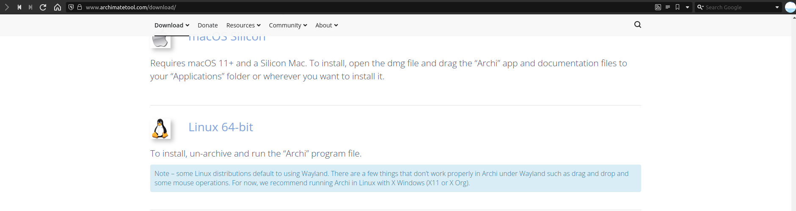

En caso de que la versión de Archi 4.10.0 no sea la versión estable más reciente, esta también se podrá encontrar aquí:

> https://www.archimatetool.com/archive/

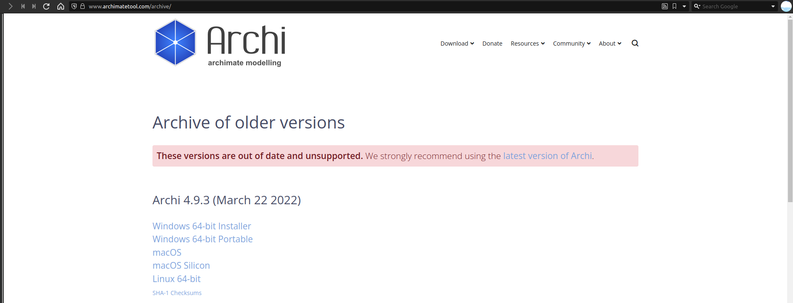

Una vez descargada la herramienta se procederá con la extracción de los recursos.

```shell
tar -xvf Archi-Linux64-4.10.0.tgz
```

### Ejecutar Aplicación Archi
----

Una vez instalado el plug-in jArchi dentro de la herramienta Archi se procederá con la ejecución de la aplicación.

Ejecutar el archivo "Archi".


La primera vez que se ejecute la aplicación Archi, esta aparecerá con la siguiente interfaz de bienvenida:


En este punto, se debe instalar el plug-in jArchi, continuar con las siguientes secciones.

## Plug-in jArchi
----

### Descargar plug-in jArchi
----

Este plug-in (jArchi) tiene su código fuente disponible en:

> https://github.com/archimatetool/archi-scripting-plugin

La generación del objeto packages para Java está fuera del alcance esta guía de instalación. Es por ello que se utilizarán
packages ya disponibles para su integración con la aplicación Archi.

> jArchi v1.2.0 https://drive.google.com/file/d/1v04bh5Kk-dz6Qgv5KBOV3sYaAlPAt8nQ

> jArchi v1.2.1 https://drive.google.com/file/d/1_W8uRECG_uOWJ_j64lKE-Dln7bpmsI0T


### Instalar plug-in jArchi
----

Para instalar el plug-in jArchi, la aplicación Archi ya debe estar instalada y en ejecución.

Seleccionar la opción `Help -> Manage Plug-ins`


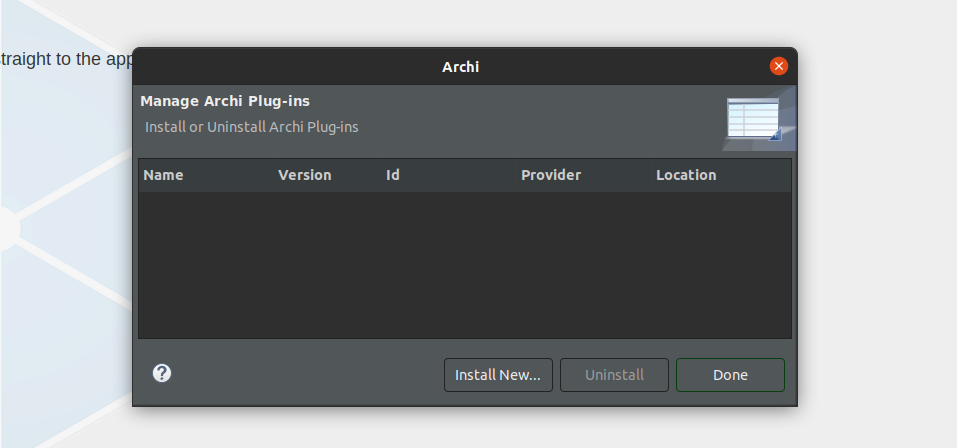

A continuación, se selecciona la opción `Install New`

En la ventana para explorar directorios, buscar el archivo comprimido con extensión `.zip` o `.archimate` descargado en la sección [Descargar plug-in jArchi](#descargar-plug-in-jarchi).

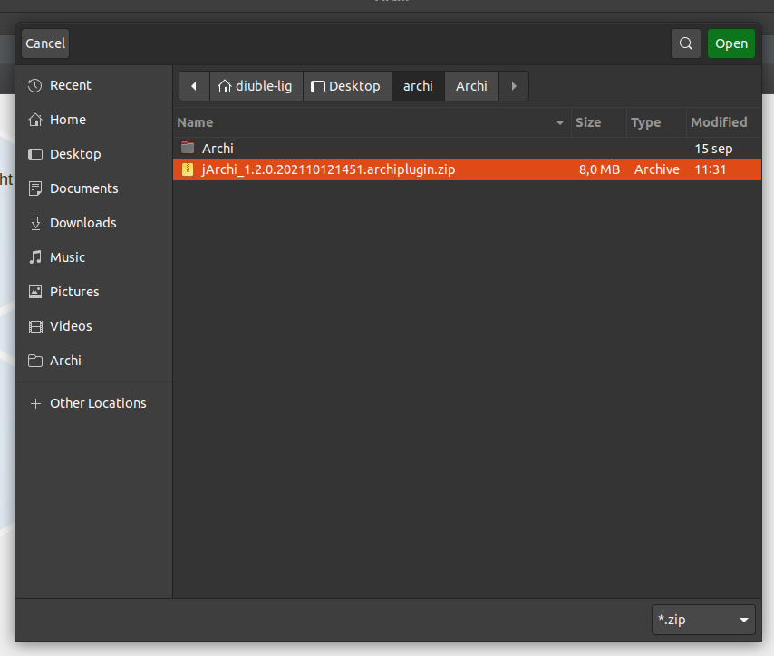

Seleccionar el archivo y dar click en `Open`.

Una vez instalado el plug-in, la aplicación Archi indicará que es necesario un reinicio de la misma para completar la instalación,
dar click en `Yes`.

Si al seleccionar nuevamente la opción `Help -> Manage Plug-ins` no se observa el plug-in instalado, seguir el flujo de la siguiente sección.

### Instalar plug-in jArchi (método alternativo)
----

Abrir un terminal (Shell) en el directorio donde se ha descargado el plug-in jArchi y copiar los elementos en el directorio `dropins/`
de la aplicación Archi.

```shell
# Debian, Ubuntu
unzip jArchi_1.2.0.202110121451.archiplugin.zip -d user.home/.archi4/dropins

# Mac
unzip jArchi_1.2.0.202110121451.archiplugin.zip -d user.home/Library/Application Support/Archi4/dropins
```

Una vez que la aplicación Archi vuelva a ejecutarse, seleccionar la opción de crear un nuevo diagrama o continuar con la utilización de la aplicación.

Repetir el flujo `Help -> Manage Plug-ins` y observar si el plugin está instalado.


### Configurar plug-in jArchi
----

Con el objetivo de ejecutar los scripts escritos para el plugin de forma esperada, este debe configurarse:

  - Cambiar el intérprete a Nashhorn 6: 
    - Dirigirse a `Edit -> Preferences`
    - Seleccionar la opción `Scrpting`
    - En el input `JavaScript Engine` seleccionar `Nashhorn ES6 (deprecated)`
    - Click en `Apply and Close`
        
  - Indicar la ruta de scripts desde donde se ejecutarán.
    - Dirigirse a `Edit -> Preferences`
    - Seleccionar la opción `Scrpting`
    - En el input `Scripts Folder` dar click en el botón `Choose`
        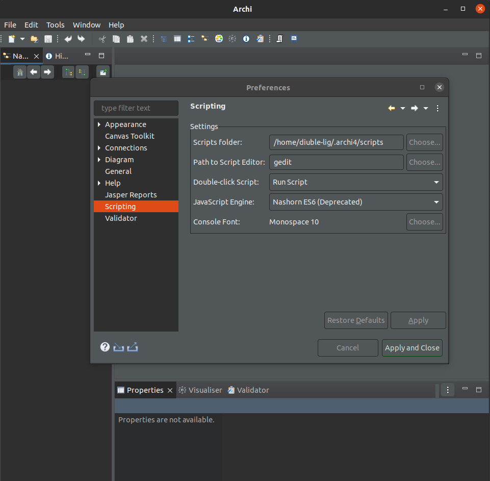
    - Se abrirá un explorador de directorios, seleccionar el directorio `scripts/` del proyecto `quantitative_analysis` y luego click en `Open`
        
    - En la ventana de `Preferences` dar click en `Apply and Close` para confirmar cambios

En este punto ya se podrá descargar el Servicio Web que contiene interfaces para ejecutar la aplicación de manera más
sencilla, mostrar y descargar los resultados de las simulaciones.

## Servicio Web
----

El proyecto `quantitative_analysis` contiene elementos para desplegar el "Servicio Web", este puede descargarse desde el siguiente enlace:

> https://github.com/realFranco/quantitative_analysis

### Descargar Servicio Web
----

El proyecto al estar disponible desde la herramienta para versionado de código fuente `GitHub` posee varias maneras de descargar
proyectos. Esta vez descargaremos el proyecto desde la terminal (Shell).

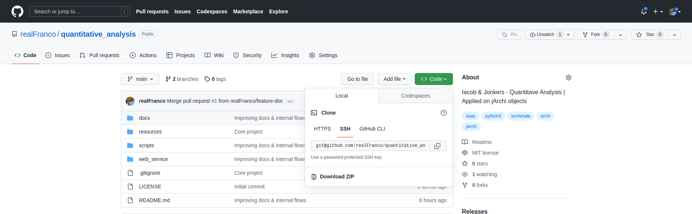

```shell
git clone git@github.com:realFranco/quantitative_analysis.git
```

### Instalar elementos para el Servicio Web
----

Una vez descargado el proyecto, abrir una terminal en el directorio `quantitative_analysis/`.

Como dependencias previas, el Host del usuario debe tener instalado como mínimo `Python` en su version estable `3.8.10`

#### Crear un entorno virtual e instalar dependencias
----

```shell
cd web_service/backend

python3 -m venv venv

source venv/bin/activate

pip3 install -r requirements.in
```

#### Agregar elementos necesarios para la ejecución de la herramienta
----

Para ejecutar de manera correcta el servicio, son necesarios algunos recursos:

 - Diagrama Archimate válido para la aplicación Archi. Un diagrama de Archi puede exportarse desde la opción
 `File -> Save As`, este diagrama y los necesarios deberán copiarse en el directorio `resources/archi_diagram_example/`

    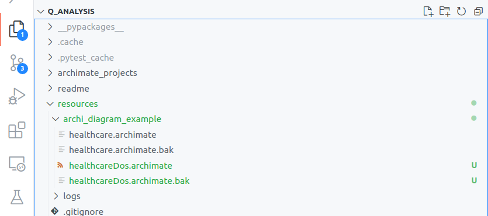

 - Logs de Amazon Web Services (AWS) CloudWatch. Está fuera del alcance de está guía cómo configurar una arquitectura en
 AWS que generen métricas de logs sobre el servicio AWS CloudWatch Insights, se agregará una imagen que refleje un poco
 cómo se consultan y exportan los logs utilizables por la infraestructura.

La siguiente sintaxis es un lenguaje particular de AWS CloudWatch Insights que permitirá consultar y filtrar logs dentro
del servicio.


Consulta para recolectar métricas de cómputo:

```
fields request_id,@message
```

Consulta para recolectar estado de ejecución:

```
fields @requestId,code
| filter code like /.+/
```

Las consultas previa generarán logs y estos deberán ser exportados en formato `.json`, almacenar estos
dos archivos ya que serán útiles en flujos posteriores del Servicio Web.

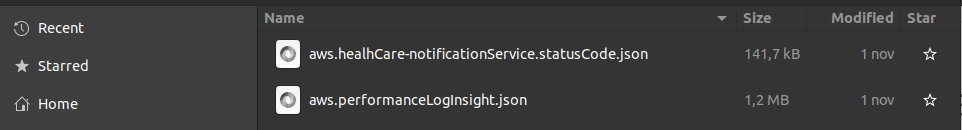

Para ampliar las referencia sobre la sintaxis de consulta de AWS CloudWatch Insights observar los siguientes enlaces:

> https://docs.aws.amazon.com/AmazonCloudWatch/latest/logs/CWL_QuerySyntax.html
> https://docs.aws.amazon.com/AmazonCloudWatch/latest/logs/CWL_QuerySyntax-examples.html

#### Ejecutar Servicio Web
----

Existe un archivo `Makefile` para ayudar en la instalación y configuración, como precondición define de manera correcta
las variables de entorno (observe en las siguientes secciones):

```shell
# Install dependencies.
make install

# Execute unit test.
make test

# Apply changes along the source code related with location resources.
make tunning

# Serve the web service on the host.
make run
```

También puedes seguir la instalación y configuración paso a paso:

 - En la sección [Crear un entorno virtual e instalar dependencias](#crear-un-entorno-virtual-e-instalar-dependencias) 
 ya se tenía un terminal (Shell) disponible, volver a utilizarlo o bien utilizar uno nuevo.

    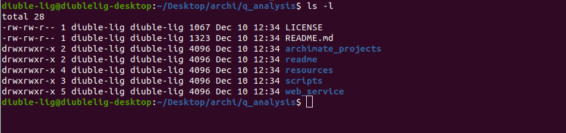

 - Generar las variables de entorno:

  ```shell
  # Dirigirse al directorio web_service/backend/
  cd web_service/backend
  # Crear el archivo con las variables de entorno y editar las variables según convenga
  cp dist.env .env
  ```

  Un ejemplo de las variables de entorno a ser definidas son las siguientes (válido para Linux y Mac):

  ```
  # Directory. Replace the current value with the folder container for "Archi".

  # Archi runnable example on Linux.
  ARCHI_RUNNABLE=/home/diuble-lig/Desktop/archi/Archi/Archi.sh

  # Archi runnable example on Mac.
  ARCHI_RUNNABLE=/Applications/Archi.app/Contents/MacOS/Archi

  # Project name. If you change the name for the current project, also change this value.
  PROJECT_NAME=quantitative_analysis

  # Directory. Absolute route from the host to the project, if you change the project directory structure, also change this value.

  # Project location example on Linux.
  PROJECT_LOCATION=/home/diuble-lig/Desktop/archi/Archi/${PROJECT_NAME}/

  # Project location example on Mac.
  PROJECT_LOCATION=/Users/user.home/Documents/DEV/${PROJECT_NAME}/

  # Localhost address to communicate between client and server.
  PROJECT_HTTP_PROTOCOL=http
  PROJECT_LOCALHOST=127.0.0.1
  PROJECT_PORT=8000
  PROJECT_LOCALHOST_URL=${PROJECT_HTTP_PROTOCOL}://${PROJECT_LOCALHOST}:${PROJECT_PORT}

  # Location file where put the configurations for jArchi scripts.
  SCRIPT_CONFIG_LOCATION=resources/jArchiConfigResources.json

  # Location file for the result file after run some jArchi scripts.
  COMPUTE_RESOURCE_LOCATION=resources/jArchiComputeResources.json

  # Location file where put the Quantitative Analysis results.
  QUANTITATIVE_ANALYSIS_RESULT_LOCATION=resources/jArchiQuantitativeAnalysisResults.json
  ```

 - Dirigirse al directorio `web_service/backend/` y ejecutar el punto de entrada del servicio web `main.py`:

  ```shell
  cd web_service/backend

  source venv/bin/activate

  python3 main.py
  ```

 - Dentro del terminal aparecerán mensajes informativos sobre el servicio ejecutado, entre ellos aparecerá una dirección web.
 `http://127.0.0.1:8000` (siempre y cuando las variables de entorno definidas en `.env` se mantengan por defecto) dar
 click en ella para mostrar la interfaz del Servicio Web.


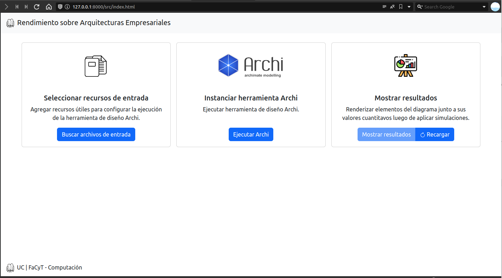

#### Utilización del Servicio Web
----

A continuación, se mostrarán iconografías e información sobre se utiliza la interfaz del Servicio Web.

##### Carga de Archivos
----

- Dar click al botón `Buscar archivos de entrada`
- Se abrirá un modal, seleccionar la opción `Amazon Web Services`
- En el input `Archivos de logs`, "buscar" los archivos de logs
  - Ubicar los `.json` descargados en la sección 
  [Agregar elementos necesarios para la ejecución de la herramienta](#agregar-elementos-necesarios-para-la-ejecución-de-la-herramienta)
   y selccionarlos
- Dar click en `Cargar archivos`
    

##### Ejecución de la herramienta Archi
----

- Dar click al botón `Ejecutar Archi`
- Detenerse y observar el carousel de imágenes en la sección `Secuencia de Imagenes para conocer cómo ejecutar simulaciones`
con el objetivo conocer los flujos a seguir antes de ejecutar el script de Análisis Cuantitativo
- En el input `Seleccionar diagrama Archimate` elegir el diagrama correspondiente sobre el cual aplicar el Análisis Cuantitativo
- En el input `Seleccionar el objeto inicial para iniciar la simulación` elegir un elemento del diagrama sobre el cual iniciar el Análisis Cuantitativo
- Dar click al botón `Ejecutar Archi` del modal
  - Si la aplicación Archi no está ejecutada, el servicio Back end la ejecutará, mostrándose la interfaz de ejecución de Archi sobre el explorador Web
      

##### Mostrar y Exportar Resultados de las Simulaciones
----

- Luego de haber ejecutado como mínimo una (1) vez los scripts de Análisis Cuantitativo dentro de la herramienta Archi, dar click en botón `Recargar` habilitando el botón `Mostrar resultados`
- Se mostrarán dos secciones, un mapa de calor junto a una tabla y más abajo dos tablas con valores
    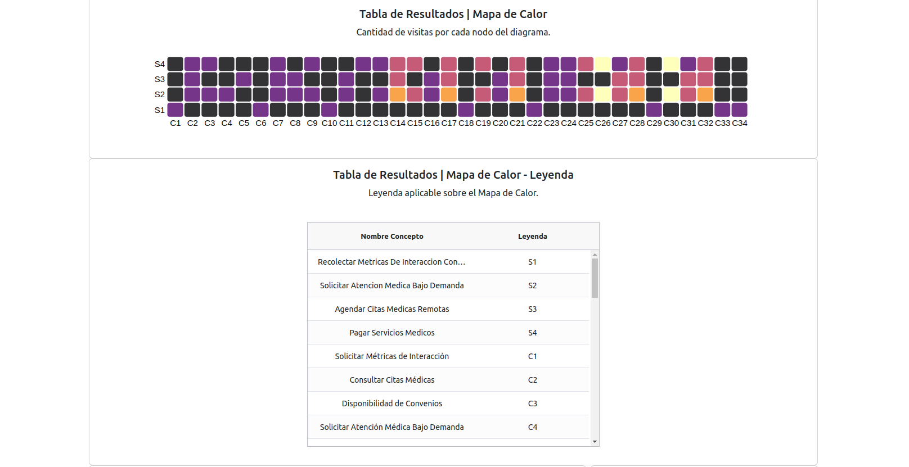

    
- En la tabla con el título `Historial de Simulaciones` se podrá dar click a cada fila, esta acción mostrará en la tabla con el título `Tabla de Resultados | Tabulado` los resultados de esa simulación en particular
- Al dar click en el botón `Limpiar` se borrarán los resultados de las simulaciones y se ocultarán las secciones de resultados
- Para exportar los resultados de la simulación seleccionada o la más reciente ejecutada dar click en el botón `Descargar Resultados`, esta mostrará una interfaz indicándole al usuario que va a descargar un archivo
    
